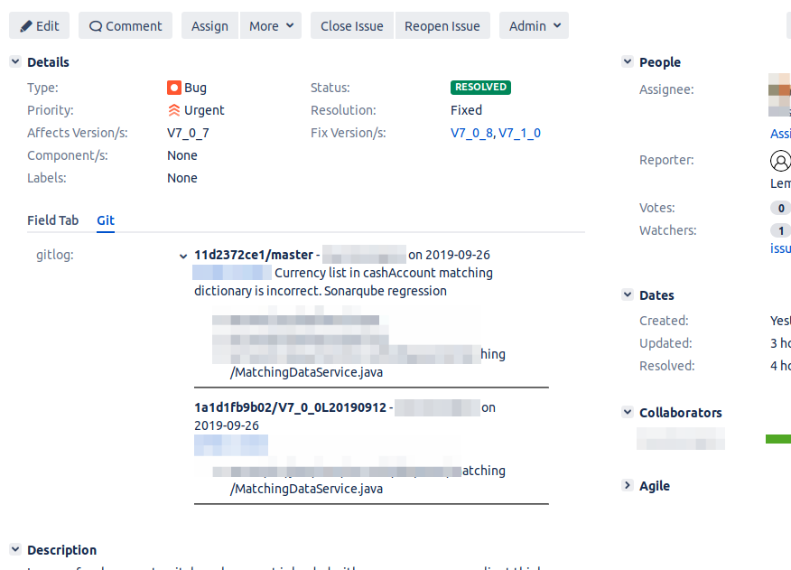

# git-jira-hook

Git hook to update JIRA server with commit info. This is a simple set of bash scripts which can be used to update a jira server with git commit information.

This work as following:
- When a user writes a commit message in git it used the name of a JIRA issue in the format PROJECT_CODE-PROJECT_NUMBER (ie. JVIN-7893). Multiple issues separated by comma are supported. Each will be updated.
- On push the server post-receive hook updates the corresponding JIRA issue via REST API.
- The issue custom field will be updated to contain (note that this is JIRA wiki code)
```
*short_hash*/branch_name - commiter_name on short_date
commit_message
- list of files modified
----
```

## Experimental

Please do some tests before messing with your git server. The [post-receive](https://git-scm.com/book/en/v2/Customizing-Git-Git-Hooks) cannot dammage or block the commit:

> This script can’t stop the push process, but the client doesn’t disconnect until it has completed, so be careful if you try to do anything that may take a long time.

but when working on the git server some attention is needed. See bellow on how to test on your local copy of the repository.

## Prerequisites

- the JIRA project must have a custom_field configured of type multi-line text configured with a wiki-style renderer. JIRA config can be quite complicated so refer to [JIRA doc](https://confluence.atlassian.com/adminjiraserver073/configuring-renderers-861253418.html) for that.
- a user with access to REST API and which can update issues on this project is required

## Installation

- install [curl](https://curl.haxx.se/) and [jq](https://stedolan.github.io/jq/) via your package manager: `sudo apt install curl jq` 
- install these scripts in a directory on the git server: `cd /home/git && git clone https://github.com/len-ro/git-jira-hook.git`
- copy the config.sample.sh to config.sh and edit the required variables carefully (no further check is done in the scripts)
- create a link inside project.git/hooks/post-receive -> post-receive-jira.sh: `cd /home/git/project.git/hooks && ln -s /home/len/git-jira-hook/post-receive-jira.sh post-receive`
- make sure git user can create the jira_refs.txt file in your folder: `cd /home/len/git-jira-hook && touch jira_refs.txt && chown len:git jira_refs.txt`. This will change according to your config and this file is used to store all tracks updated by this script

## Cleanup

Note that this will create a list of updated tracks inside *jira_refs.txt*. If you want to clean the custom field of all these tracks (ie for testing) run: `clean-gitlog.sh`

## Historical

You can run this script to update the git from old history, or for testing with a command similar to:
```
git log --after={2019-09-23} --date-order --reverse --pretty=%h | while read rev; do /home/len/free/jiraGitLog/post-receive-jira.sh manual $rev; done
```
this will update the issues referenced in all commits since 23 sept 2019 for instance or
```
./post-receive-jira.sh manual 920fae70ae
```
to update the jira issue referenced in commit 920fae70ae

## Example 



